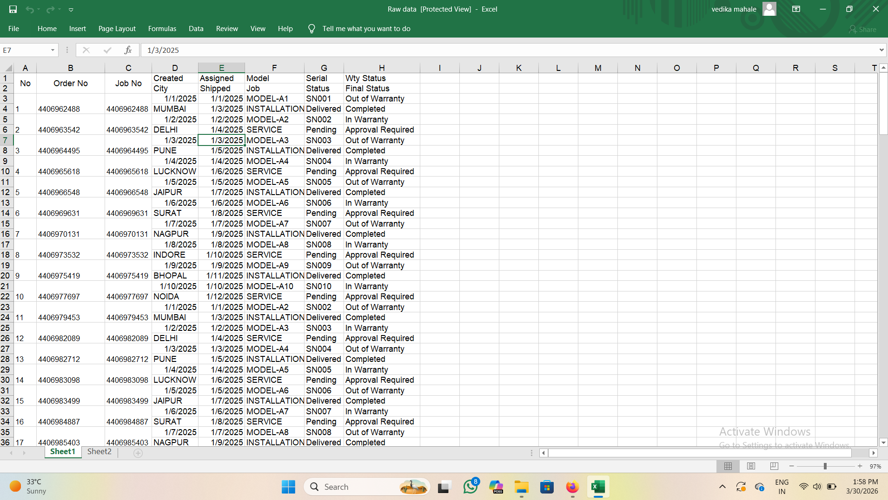
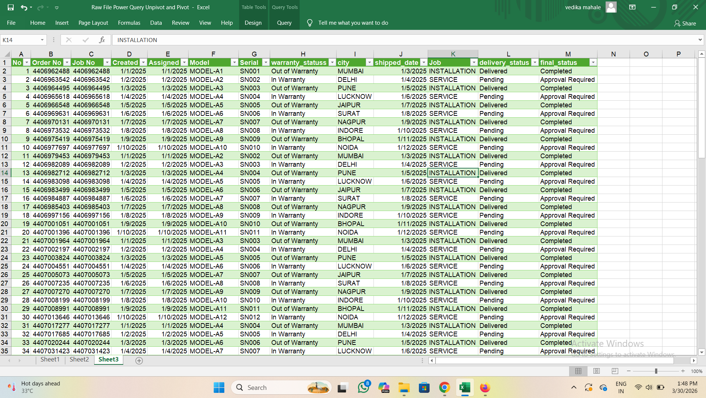
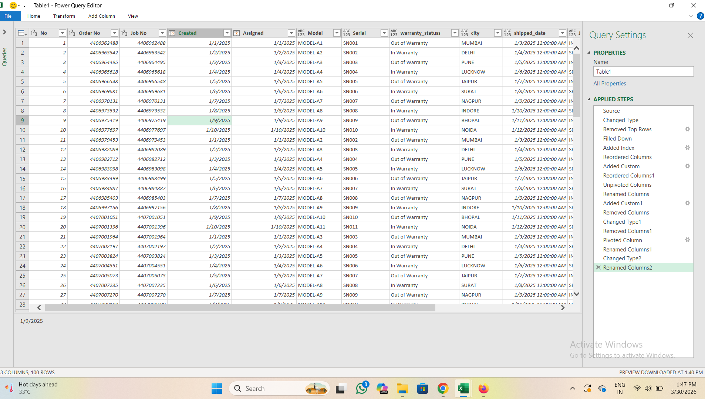

# Data-Cleaning-Project
Data Cleaning using Excel Power Query

## 📌 Overview
This project demonstrates data cleaning and transformation using Excel Power Query. 
Raw data was processed and converted into a structured format for analysis.

## 🛠️ Tools Used
- Microsoft Excel
- Power Query

## 🔧 Data Cleaning Steps
- Removed unnecessary columns  
- Changed data types (dates, text, numbers)  
- Renamed columns for better understanding  
- Handled missing and null values  
- Removed duplicates  
- Standardized text values (e.g., status fields)  
- Applied transformations using Power Query  

## ⚙️ Power Query Applied Steps
The data cleaning process was performed using Power Query’s Applied Steps panel, ensuring automation and repeatability.

## 📷 Screenshots

### 🔹 Raw Data

### 🔹 Cleaned Data

### 🔹 Power Query Steps

## 💡 Key Learning
- Learned how to clean and transform data using Power Query  
- Understood how to automate repetitive data cleaning tasks  
- Improved data quality for better analysis  

## 🎯 Conclusion
Power Query enables efficient and automated data cleaning, making datasets ready for analysis with minimal manual effort.
